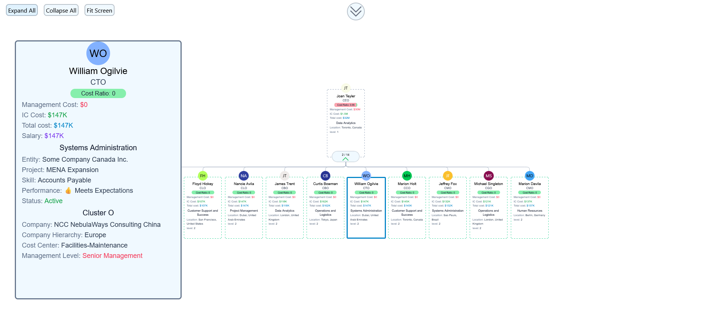

## Project Setup

```sh
npm install
```

### Compile and Hot-Reload for Development

```sh
npm run dev
```

### Compile and Minify for Production

```sh
npm run build
```

## Example Image



## Usage
The org graph is pre-loaded with a cut down version of the Upload me csv.
Click the double chevron to pull down or push up the drawer for uploading your own csv.
Click a node to highlight it and and show more details on the left side.
Click a highlighted node to remove it from highlighting it.
There are buttons on the left side to expand/collapse all and to fit to screen.